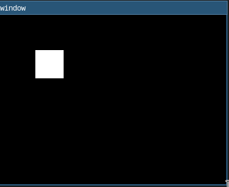

# Zig GUI Interface with SDL



This is a simple GUI project created in Zig, using the SDL (Simple DirectMedia Layer) library. The GUI includes.

## Prerequisites

Before running this project, ensure that you have Zig and SDL2 installed on your system.

- [Zig](https://ziglang.org/)
- [SDL2](https://libsdl.org/)

## How to Run

Follow these steps to run the GUI:

1. Clone this repository:

   ```bash
   git clone https://github.com/Ahegys/ZiggerUI.git
   cd ZiggerUI
   ```

2. Run and build:

   ```bash
   zig build
   ./zig-out/bin/Zigger_x86
   ```
